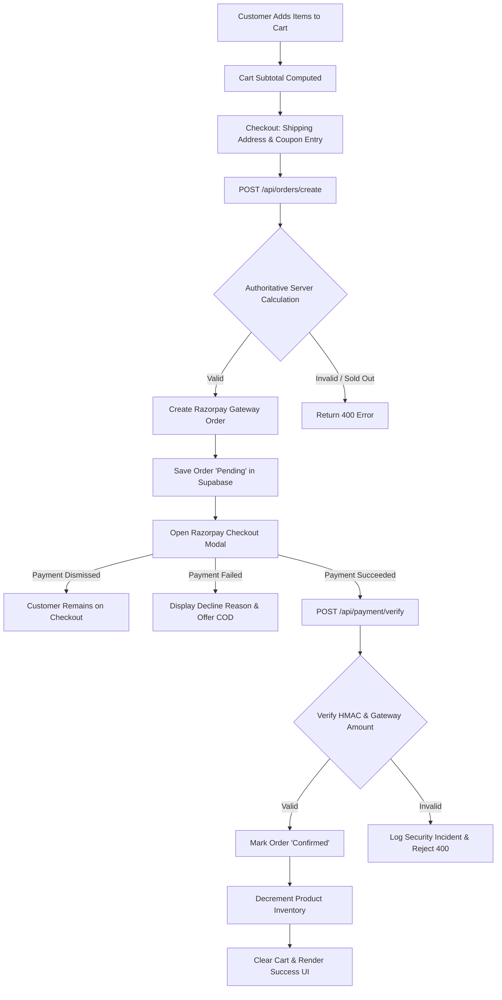

# INVEINS RAZORPAY COMPLIANCE AUDIT

**Target Brand:** INVEINS APPARELS  
**Audited Domain (Canonical):** `https://inveins.studio`  
**Audited Domain (Live Deployment):** `https://inveins.vercel.app`  
**Audit Date:** September 30, 2026  
**Auditor:** Senior Razorpay Payment Gateway Compliance Auditor & E-Commerce Security Reviewer  
**Audit Classification:** READ-ONLY COMPLIANCE INSPECTION (No code was modified)

---

## 1. Executive Summary

| Category | Readiness Status | Summary Verdict |
|:---|:---:|:---|
| **WEBSITE COMPLIANCE** | **PARTIAL** | Policy pages exist and are well-drafted, but `/contact` is missing a full physical street address, and `/contact` is absent from `sitemap.ts`. The custom domain `inveins.studio` has no DNS host resolution. |
| **PAYMENT INTEGRATION** | **PARTIAL** | Server-side pricing validation and HMAC-SHA256 signature verification are mathematically robust. However, `Cross-Origin-Opener-Policy: same-origin` breaks Razorpay popups, and the webhook ignores `order.paid` and refund events. |
| **SECURITY** | **PARTIAL** | Admins are protected via signed HttpOnly cookies and origin validation, and client-side price tampering is blocked. However, in-memory rate limiting is ineffective on serverless, fallback secrets exist, and admin login leaks all customer orders into browser `localStorage`. |
| **BUSINESS / KYC** | **UNKNOWN / NEEDS HUMAN VERIFICATION** | GST (`09CLWPV7429M2ZO`), Founder name (`Shaurya Vishnoi`), and city (`Kanpur, UP`) are consistent across pages. However, official business bank account ownership, PAN linkage, MCA/firm registration, and official Razorpay MCC category require merchant verification. |
| **POLICY COMPLIANCE** | **FAIL** | Multiple stark mismatches: policies promise 5–7 day automatic gateway refunds and automated SMS/Email notifications, but code contains zero refund API workflows and zero transactional notification integrations. |
| **PRODUCTION CONFIGURATION** | **FAIL** | Local `.env` contains Razorpay Test keys (`rzp_test_...`) and localhost references. Canonical domain `https://inveins.studio` fails DNS lookup (`no such host`). Live deployment is currently running on `inveins.vercel.app`. |

---

## 2. Critical Blockers

| ID | Finding | Evidence | Risk | Required Action |
|:---|:---|:---|:---|:---|
| **BLK-01** | **Canonical Domain DNS Resolution Failure** | Attempting HTTP request to `https://inveins.studio` returns `lookup inveins.studio: no such host`. The site only resolves on `https://inveins.vercel.app`. | **CRITICAL** | Point DNS A/CNAME records for `inveins.studio` to Vercel/production host with active SSL before submitting domain to Razorpay. |
| **BLK-02** | **COOP Header Breaks Razorpay Checkout & 3DS Popups** | `next.config.mjs` (Line 53): `Cross-Origin-Opener-Policy: 'same-origin'`. | **CRITICAL** | Change COOP header in `next.config.mjs` to `same-origin-allow-popups` or remove it. Razorpay Checkout modal, UPI app handshakes, and bank 3D Secure redirects will break or fail window postMessage communication under `same-origin`. |
| **BLK-03** | **Missing Physical Address on Contact Us Page** | `src/app/contact/page.tsx` (Lines 82–120): Lists email, phone, support hours, and WhatsApp, but contains NO physical/operating address. | **HIGH** | Razorpay merchant verification requires complete physical operating/registered address visibly published on the Contact Us page matching KYC documentation. |
| **BLK-04** | **Zero Refund Architecture in Backend** | Grep across `src/`: No refund API route, no call to Razorpay Refund API (`/v1/payments/:id/refund`), and `src/app/api/orders/update-status/route.ts` (Line 23) does not include `Refunded` in `validStatuses`. | **HIGH** | Build a dedicated, admin-authenticated refund endpoint (`/api/orders/[id]/refund`) or clarify in policy that manual refunds are initiated through the gateway dashboard. |
| **BLK-05** | **Webhook Missing `order.paid` Event Handling** | `src/app/api/payment/webhook/route.ts` (Lines 58, 177, 224): Only handles `payment.captured` and `payment.failed`. Ignores `order.paid` and all `refund.*` events. | **HIGH** | Add explicit event listener for `order.paid` in `src/app/api/payment/webhook/route.ts` so orders with auto-capture enabled are never dropped. |
| **BLK-06** | **Insecure Order Token Fallback Secret in Production** | `src/app/api/orders/create/route.ts` (Line 14): Fallback string `'inveins_production_order_signing_secure_fallback'` used if `ORDER_SIGNING_SECRET` is unset. | **HIGH** | Fail closed in production (`throw new Error(...)`) if `ORDER_SIGNING_SECRET` is missing, preventing predictable token generation. |
| **BLK-07** | **Customer PII Storage Exposure via Admin Session** | `src/context/CartContext.tsx` (Lines 231–242, 309): When admin logs in, `setOrders(data.orders)` dumps all customer orders into `localStorage.setItem('inveins_my_orders', ...)`. | **HIGH** | Decouple administrative order queries from client-side CartContext `orders` state to prevent persisting customer PII to browser `localStorage`. |

---

## 3. Razorpay Compliance

Official Requirement Cross-Check based on RBI Guidelines & Razorpay Merchant Activation Standard Operating Procedures (SOP):

| Requirement | Status | Evidence | Action |
|:---|:---:|:---|:---|
| **1. Functional Website with HTTPS** | **PARTIAL** | `https://inveins.vercel.app` is functional and encrypted, but canonical `https://inveins.studio` is not live. | Connect DNS and SSL for `https://inveins.studio` prior to account submission. |
| **2. About Us with Business Overview** | **PASS** | `src/app/about/page.tsx` explains brand, founder Shaurya Vishnoi, Kanpur studio, and textile manufacturing. | None required. |
| **3. Contact Us with Email, Phone & Address** | **FAIL** | `src/app/contact/page.tsx` has email and phone, but lacks physical business address. | Add complete registered address to `src/app/contact/page.tsx`. |
| **4. Terms & Conditions** | **PASS** | `src/app/terms/page.tsx` includes comprehensive clauses (governing law, Kanpur jurisdiction, IP, liability, pricing). | Ensure registered entity name exactly matches GST/Bank account. |
| **5. Privacy Policy with Data & Payment Disclosure** | **PASS** | `src/app/privacy/page.tsx` explicitly names Razorpay, PCI-DSS compliance, non-storage of card/PIN data, and grievance officer details. | Update Grievance Officer section to include officer's specific legal name. |
| **6. Refund & Cancellation Policy** | **FAIL** | `src/app/refund-policy/page.tsx` specifies 5–7 day refund window, but backend code has zero refund capability. | Implement backend refund processing via Razorpay API or document manual dashboard procedure. |
| **7. Shipping & Delivery Policy** | **PASS** | `src/app/shipping-policy/page.tsx` specifies 24–48h dispatch, 3–7 day delivery, ₹70 fee below ₹999, free above ₹999. | None required. |
| **8. Visible Pricing in INR with Tax Statement** | **PASS** | `src/app/product/[id]/page.tsx` (Lines 279–284): Displays price in `₹` (INR) and states "MRP Inclusive of all taxes". | None required. |
| **9. Server-Side Razorpay Order Creation** | **PASS** | `src/app/api/orders/create/route.ts` (Line 162): Razorpay order created server-side via `createRazorpayOrder` in `src/lib/payment-security.ts`. | None required. |
| **10. Cryptographic Signature Verification** | **PASS** | `src/app/api/payment/verify/route.ts` (Lines 25–29): Constant-time HMAC-SHA256 signature verification via `verifyRazorpaySignature`. | None required. |
| **11. Authoritative Amount Validation** | **PASS** | `src/app/api/payment/verify/route.ts` (Lines 93–110): Gateway amount verified against application order grand total. | None required. |
| **12. Webhook Signature Verification** | **PARTIAL** | `src/app/api/payment/webhook/route.ts` (Line 43): Verifies HMAC-SHA256, but bypasses verification when `NODE_ENV !== 'production'`. | Enforce webhook verification across all staging/production environments. |
| **13. Non-Storage of Card / Sensitive Financial Data** | **PASS** | Audited codebase: No card numbers, CVVs, or bank credentials collected or stored in database or state. | None required. |
| **14. Eligible Business Category** | **PASS** | Sells apparel (Tees, Joggers, Hoodies, Gym wear). Eligible under Razorpay MCC "5691 - Men's and Women's Clothing Stores". | Select correct category in Razorpay Dashboard. |

---

## 4. Website Policy Audit

| Page | Exists | Accessible | Complete | Consistent | Status | Evidence / Notes |
|:---|:---:|:---:|:---:|:---:|:---:|:---|
| **About Us** | Yes | Yes (`/about`) | Yes | Yes | **PASS** | [about/page.tsx](file:///c:/Users/ritik/OneDrive/Documents/Cothesis/src/app/about/page.tsx). Contains founder bio, mission, Kanpur production details. |
| **Contact Us** | Yes | Yes (`/contact`) | Partial | Partial | **FAIL** | [contact/page.tsx](file:///c:/Users/ritik/OneDrive/Documents/Cothesis/src/app/contact/page.tsx). Missing physical street address. Missing from `sitemap.ts`. |
| **Terms & Conditions** | Yes | Yes (`/terms`) | Yes | Yes | **PASS** | [terms/page.tsx](file:///c:/Users/ritik/OneDrive/Documents/Cothesis/src/app/terms/page.tsx). Legal entity: INVEINS APPARELS, GST: 09CLWPV7429M2ZO. Kanpur jurisdiction. |
| **Privacy Policy** | Yes | Yes (`/privacy`) | Yes | Yes | **PASS** | [privacy/page.tsx](file:///c:/Users/ritik/OneDrive/Documents/Cothesis/src/app/privacy/page.tsx). Comprehensive data usage, non-storage of card data, Grievance Officer details. |
| **Refund Policy** | Yes | Yes (`/refund-policy`) | Yes | Partial | **FAIL** | [refund-policy/page.tsx](file:///c:/Users/ritik/OneDrive/Documents/Cothesis/src/app/refund-policy/page.tsx). Complete text, but conflicts with total absence of backend refund code. |
| **Shipping Policy** | Yes | Yes (`/shipping-policy`) | Yes | Yes | **PASS** | [shipping-policy/page.tsx](file:///c:/Users/ritik/OneDrive/Documents/Cothesis/src/app/shipping-policy/page.tsx). Pan-India coverage, Delhivery/BlueDart/DTDC couriers, timelines match checkout. |
| **FAQ Page** | Yes | Yes (`/faq`) | Yes | Yes | **PASS** | [faq/page.tsx](file:///c:/Users/ritik/OneDrive/Documents/Cothesis/src/app/faq/page.tsx). Answers sizing, shipping, payments, Razorpay security, exchanges. |

---

## 5. Business Identity Audit

*(Credentials and secrets are strictly redacted in accordance with compliance guidelines)*

| Item | Website Appearance | Codebase Appearance | Razorpay Config / Env | Status | Findings & Contradictions |
|:---|:---|:---|:---|:---:|:---|
| **Legal Entity Name** | INVEINS APPARELS | `INVEINS APPARELS` in legal pages; `"legalName": "Inveins"` in `layout.tsx` | Redacted in dashboard | **PASS** | Consistent across footer, Terms, Privacy, and policies. Minor casing variation in JSON-LD. |
| **Brand Name** | INVEINS | `INVEINS` / `inveins-fashion` | Redacted in dashboard | **PASS** | Uniformly branded across navigation, titles, and logos. |
| **GST Number** | 09CLWPV7429M2ZO | `09CLWPV7429M2ZO` in footer, Terms, and `layout.tsx` | Pending merchant submission | **PASS** | State code `09` correctly designates Uttar Pradesh. Entity PAN matches chars 3-12 (`CLWPV7429M`). |
| **Founder / Management** | Shaurya Vishnoi (MD & CEO) | `Shaurya Vishnoi` in footer and `layout.tsx` | Pending merchant submission | **PASS** | Consistently named as founder and craftsman in Kanpur Studio. |
| **Operating Address** | Kanpur Nagar, Uttar Pradesh 208001 | `Kanpur Nagar, Uttar Pradesh 208001` in Terms/Privacy | Pending merchant submission | **PARTIAL** | Pincode and city provided, but specific street/building number is omitted on public pages. |
| **Contact Email** | `inveins24@gmail.com` | `inveins24@gmail.com` | Configured in dashboard | **PASS** | Fully consistent across all pages. Note: Free Gmail domain used rather than `@inveins.studio`. |
| **Contact Phone / WhatsApp** | `+91 79852 32434` | `917985232434` / `+91 79852 32434` | Configured in dashboard | **PASS** | Fully consistent across header, contact page, policies, and footer. |
| **Primary Domain** | `https://inveins.studio` | `https://inveins.studio` in metadata/sitemap | Configured in dashboard | **FAIL** | Domain does not resolve via DNS (`no such host`). Live traffic currently served via `inveins.vercel.app`. |

---

## 6. Payment Integration Audit

### 6.1 Order Creation (`/api/orders/create`)
- **Server-Side Validation:** Authoritative catalog query executed via `supabaseAdmin.from('inveins_products')` with static `PRODUCTS` fallback.
- **Price Tampering Defense:** Client cannot inject custom price or amount. Total is computed strictly on server (`genuinePrice * qty`).
- **Shipping Fee Enforcement:** Server authoritatively calculates shipping: orders `< 999` incur `₹70`, orders `>= 999` are `₹0`.
- **Coupon Validation:** Server validates coupon codes against strict whitelist (`FIRST10`, `INVEINS15`, `HEAVY20`). No stacking permitted.
- **Gateway Order Creation:** Calls Razorpay official REST API (`POST https://api.razorpay.com/v1/orders`) using HTTP Basic Auth with `amount = Math.round(grandTotal * 100)` in paise and currency `INR`.
- **Initial Status:** Set to `Pending` for online payments; only `cod` orders are initialized as `Confirmed`.

### 6.2 Payment Verification (`/api/payment/verify`)
- **Signature Verification:** Implemented with `crypto.createHmac('sha256', secret).update(orderId + '|' + paymentId)` using `crypto.timingSafeEqual` to prevent timing attacks.
- **Correlation Check:** Verifies that `razorpay_order_id` matches the stored `razorpay_order_id` in the database order record.
- **Gateway Amount Cross-Check:** Fetches authoritative payment order from Razorpay API (`https://api.razorpay.com/v1/orders/:id`) and checks `rzpOrderDetails.amount === expectedPaise`.
- **Deduplication:** Checks whether `payment_id` has already been credited to another order (`neq('id', cleanOrderId)`).
- **Status Transition:** Safely updates order status to `Confirmed` and executes atomic inventory decrement.

### 6.3 Webhook Processing (`/api/payment/webhook`)
- **Raw Body Handling:** Reads `req.text()` prior to parsing, ensuring accurate cryptographic HMAC signature calculation.
- **Signature Header:** Checks `x-razorpay-signature` against `RAZORPAY_WEBHOOK_SECRET`.
- **Event Handling:**
  - `payment.captured`: Correlates order, checks amount, transitions to `Confirmed`, decrements stock.
  - `payment.failed`: Records error description in order metadata, transitions status to `Failed` only if previously `Pending`.
  - **DEFECT:** Event `order.paid` is UNHANDLED. If a merchant enables payment auto-capture, Razorpay triggers `order.paid`. The webhook currently ignores this event and returns a 200 no-op.
  - **DEFECT:** Events `refund.created`, `refund.processed`, and `refund.failed` are UNHANDLED.

### 6.4 Refund Implementation
- **Status:** **NON-EXISTENT**.
- There is no API route, server action, or UI component for initiating or synchronizing refunds.
- Order status enum in `src/app/api/orders/update-status/route.ts` lacks `Refunded`.
- Deleting an order via `DELETE /api/orders/[id]` deletes the database row with zero refund API trigger.

---

## 7. Security Audit

### 7.1 Authentication & Authorization
- **Admin Authentication:** Implemented via signed session tokens (`admin_session_<timestamp>.<signature>`) stored in `HttpOnly`, `SameSite: strict`, `Secure` cookies.
- **Admin Rate Limiting:** Brute force on `/api/admin/login` restricted to 5 attempts per 15 minutes.
- **CSRF Defense:** `validateRequestOrigin` checks `origin` against `host` header on administrative mutations.
- **Customer Authentication:** Does not exist. Customer portal tracks orders via `localStorage` or one-time HMAC-signed `verification_token` in URLs.

### 7.2 API Security & Rate Limiting
- **In-Memory Rate Limiting:** `src/lib/rate-limit.ts` uses an in-memory `Map`. On serverless platforms (Vercel), memory is ephemeral and unshared across function instances, limiting effectiveness.
- **Rate Limit Flush Vulnerability:** `src/lib/rate-limit.ts` (Line 63): When `tracker.size > 10000`, it executes `tracker.clear()`, wiping all rate limits across all IPs simultaneously.
- **Input Sanitization:** `src/lib/sanitize.ts` strips HTML tags, `<script>` tags, and `javascript:` URIs from customer inputs.

### 7.3 Secrets & Environment
- **Private Secrets Committed to Git:** **NONE**. `.env` is properly ignored in `.gitignore`.
- **Client Bundle Secret Leak:** `NEXT_PUBLIC_RAZORPAY_KEY_ID` is exposed to browser bundles (normal and required by Razorpay Checkout.js). Secret keys (`RAZORPAY_KEY_SECRET`, `RAZORPAY_WEBHOOK_SECRET`, `ORDER_SIGNING_SECRET`) are strictly accessed server-side.
- **Fallback Secrets:**
  - `src/app/api/orders/create/route.ts` (Line 14): Fallback string used if `ORDER_SIGNING_SECRET` is unset.
  - `src/lib/auth.ts` (Line 21): Uses `'inveins_dev_pin'` only in non-production; fails closed in production.

### 7.4 Transport & Headers (`next.config.mjs`)
- `Strict-Transport-Security: max-age=63072000; includeSubDomains; preload` (PASS)
- `X-Content-Type-Options: nosniff` (PASS)
- `X-Frame-Options: DENY` (PASS)
- `Referrer-Policy: strict-origin-when-cross-origin` (PASS)
- `Permissions-Policy: camera=(), microphone=(), geolocation=()` (PASS)
- `Content-Security-Policy`: Correctly includes `https://checkout.razorpay.com`, `https://*.razorpay.com`, `https://cdn.razorpay.com`, `https://api.razorpay.com` across `script-src`, `connect-src`, `frame-src`, and `img-src`.
- **CRITICAL DEFECT:** `Cross-Origin-Opener-Policy: same-origin` blocks Razorpay popups and 3DS redirects. Must be changed to `same-origin-allow-popups`.

---

## 8. Checkout Audit

### Verified Protections:
- Cart quantity tampering is bounded between 1 and 20.
- Coupon calculation is re-verified strictly server-side.
- Stock availability is checked before order creation and decremented atomically upon confirmation.
- Direct checkout confirmation without gateway verification is prohibited for online payment methods.

---

## 9. Production Configuration Audit

| Configuration Item | Required for Razorpay Activation | Current Code / Repo State | Status |
|:---|:---|:---|:---:|
| **Canonical URL** | Live HTTPS on custom domain | `https://inveins.studio` (DNS host not found) | **FAIL** |
| **Active Staging/Live URL**| Reachable HTTPS site | `https://inveins.vercel.app` (Fully responsive) | **PASS** |
| **Razorpay Mode** | Live Mode (`rzp_live_...`) | Local `.env` has Test Mode (`rzp_test_...`) | **NEEDS MERCHANT ACTION** |
| **Razorpay Webhook Secret**| Unique production secret | Set in local `.env` as test secret | **NEEDS MERCHANT ACTION** |
| **Database Connection** | Scalable PostgreSQL pooler | Supabase configured (`jpbotzytaekgvewyxljl`) | **PASS** |
| **Database Schema** | Dedicated payment columns | Scripts present in `supabase-migration-razorpay.sql` | **PASS** |
| **Sitemap Coverage** | All compliance pages indexed | `/contact` omitted from `src/app/sitemap.ts` | **FAIL** |

---

## 10. Policy vs Code Mismatch

This section documents contradictions between legal promises made on public pages and the software's actual behavior:

### Mismatch 1: Refund Processing
- **POLICY SAYS:** *Refund & Cancellation Policy (Section 04):* "Upon approval of the return, refunds are initiated immediately and credited back to the original source of payment within 5 to 7 business days..."
- **CODE DOES:** The codebase has **zero refund APIs, zero calls to Razorpay's refund endpoints, and no refund webhook event handlers**. If an order is cancelled or returned, there is no technical workflow in the app to initiate or track the refund.

### Mismatch 2: Automated Customer Notifications
- **POLICY SAYS:** *Shipping & Delivery Policy (Section 04):* "As soon as your shipment is scanned by the courier partner, an automated confirmation is dispatched via Email and SMS/WhatsApp containing your Air Waybill (AWB) tracking number..."
- **CODE DOES:** The codebase has **no email integration (Resend, SendGrid) and no SMS/WhatsApp API gateway (Twilio, MSG91)**. Status changes in `/api/orders/update-status` only perform database updates and terminal logging; no customer messages are dispatched.

### Mismatch 3: Order Cancellation by Customer
- **POLICY SAYS:** *Refund & Cancellation Policy (Section 01):* "You can request cancellation of your order at any point prior to order dispatch (typically within 12 to 24 hours)..."
- **CODE DOES:** The customer portal (`/account`) provides **no cancellation trigger or form**. Cancellation must be handled entirely out-of-band via WhatsApp/Email. Furthermore, when an admin sets status to `Cancelled`, previously decremented stock is not restored to the catalog.

### Mismatch 4: Account Data Storage
- **POLICY SAYS:** *Privacy Policy (Section 01):* "Account Information: We collect account information..."
- **CODE DOES:** There are **no customer user accounts or passwords**. Customer orders and addresses are stored purely in browser `localStorage`.

---

## 11. Missing Items

1. **DNS Configuration for `inveins.studio`:** Domain is registered in metadata but has no DNS host records.
2. **Full Physical Street Address on Contact Page:** `src/app/contact/page.tsx` lacks premises/street address.
3. **Contact Page in Sitemap:** `src/app/sitemap.ts` does not include `https://inveins.studio/contact`.
4. **Razorpay Webhook Events:** Handlers for `order.paid`, `refund.created`, `refund.processed`, and `refund.failed`.
5. **Backend Refund Processing:** No integration with Razorpay Refund API.
6. **Stock Re-Incrementation:** No mechanism to restore inventory when orders are cancelled or fail.
7. **Transactional Messaging Provider:** No service integrated to send the order confirmation emails/SMS promised in the shipping policy.
8. **Distributed Rate Limiting:** No Upstash Redis or Edge rate limiter for serverless infrastructure.

---

## 12. Unknown / Human Verification Required

The following compliance criteria cannot be verified from source code and must be confirmed directly by the merchant:

1. **Bank Account Verification:** Merchant bank account name must match the legal business name (`INVEINS APPARELS` or proprietor name `Shaurya Vishnoi`).
2. **PAN / GST Registration:** GSTIN `09CLWPV7429M2ZO` must be verified against the active GST portal records and linked to the same PAN submitted to Razorpay.
3. **Merchant Category Code (MCC):** Ensure the account is classified under `5691` (Apparel/Clothing) in the Razorpay dashboard, matching actual catalog merchandise.
4. **Physical Operating Address Verification:** Proof of business address (utility bill, GST certificate, lease agreement) for Kanpur premises must be uploaded during KYC.
5. **Production Keys in Hosting Dashboard:** Verification that `RAZORPAY_KEY_ID` (Live) and `RAZORPAY_KEY_SECRET` (Live) are correctly populated in Vercel/production environment variables.

---

## 13. Razorpay Rejection Risk Areas

1. **Website Accessibility Failure (Risk: CRITICAL):** If `https://inveins.studio` is submitted before DNS points to the site, Razorpay automated review will fail immediately.
2. **Cross-Origin Opener Policy Rejection (Risk: HIGH):** During test transactions by Razorpay review personnel, payment modal/popup communication may fail due to `COOP: same-origin`.
3. **Contact Details Incompleteness (Risk: HIGH):** Razorpay compliance reviewers check for a physical address on the Contact Us page. If only email and phone are present, verification is paused.
4. **Policy-to-Catalog Inconsistency (Risk: MEDIUM):** Sells retail apparel, but includes B2B/Wholesale enquiry forms. Merchant must confirm whether payment gateway is intended for retail consumer checkout only, B2B advance collections, or both.
5. **Free Gmail Domain (Risk: LOW-MEDIUM):** Using `inveins24@gmail.com` on a brand site can prompt requests for business email verification (`care@inveins.studio`).

---

## 14. Exact Pre-Submission Checklist

- [ ] **Domain & DNS:** Point `inveins.studio` DNS (A/CNAME) to Vercel and verify SSL resolution.
- [ ] **COOP Security Header:** Change `Cross-Origin-Opener-Policy` from `same-origin` to `same-origin-allow-popups` in `next.config.mjs`.
- [ ] **Contact Us Address:** Add full physical operating/registered address in `src/app/contact/page.tsx`.
- [ ] **Sitemap Indexing:** Add `/contact` to `staticRoutes` in `src/app/sitemap.ts`.
- [ ] **Webhook Coverage:** Add handler for `order.paid` in `src/app/api/payment/webhook/route.ts`.
- [ ] **Order Token Secret:** Fail closed if `ORDER_SIGNING_SECRET` is unset in production (`src/app/api/orders/create/route.ts`).
- [ ] **Decouple Admin Orders in CartContext:** Prevent admin session from storing all customer orders into browser `localStorage`.
- [ ] **Live Razorpay Credentials:** Generate Live API Keys in Razorpay Dashboard and set `RAZORPAY_KEY_ID` (`rzp_live_...`) and `RAZORPAY_KEY_SECRET` in production hosting dashboard.
- [ ] **Live Webhook Endpoint:** Configure `https://inveins.studio/api/payment/webhook` with events `payment.captured`, `payment.failed`, and `order.paid` in Razorpay Dashboard.
- [ ] **KYC Document Consistency:** Ensure Business Legal Name, GSTIN, PAN, and Bank Account statement match identically.
- [ ] **Grievance Officer Name:** Insert legal officer name in `src/app/privacy/page.tsx`.

---

## 15. Final Classification

### BLOCKERS
*(Must be resolved before submitting for Razorpay merchant activation)*
1. **Fix DNS / Domain Routing:** Ensure `https://inveins.studio` resolves over HTTPS without errors.
2. **Fix COOP Header:** Change `Cross-Origin-Opener-Policy: same-origin` to `same-origin-allow-popups` in `next.config.mjs`.
3. **Add Physical Address to Contact Page:** Update `src/app/contact/page.tsx` with full operating address.
4. **Add `order.paid` Webhook Handler:** Support auto-capture event in `src/app/api/payment/webhook/route.ts`.

### IMPORTANT FIXES
*(Must be resolved before handling live customer traffic)*
1. **Add `/contact` to Sitemap:** Update `src/app/sitemap.ts`.
2. **Eliminate Insecure Order Fallback Secret:** Update `src/app/api/orders/create/route.ts`.
3. **Fix Admin PII Leak to LocalStorage:** Decouple admin order fetches from `CartContext` local storage persistence.
4. **Stock Restoration on Cancellation:** Implement inventory return when order status transitions to `Cancelled`.

### RECOMMENDED HARDENING
*(Architectural improvements for security and reliability)*
1. **Implement Centralized Rate Limiting:** Transition from in-memory Map to Upstash Redis (`@upstash/ratelimit`) for serverless edge consistency.
2. **Implement Transactional Email Gateway:** Integrate Resend or Postmark to fulfill policy promises of automated dispatch notifications.
3. **Automated Refund API Integration:** Implement direct Razorpay refund API dispatch from administrative dashboard.

### HUMAN VERIFICATION
*(Merchant-only validation items)*
1. Match bank account title to `INVEINS APPARELS` or `Shaurya Vishnoi`.
2. Confirm GST status for `09CLWPV7429M2ZO` on the GST portal.
3. Set live Razorpay keys and webhook secrets in Vercel environment variables.
