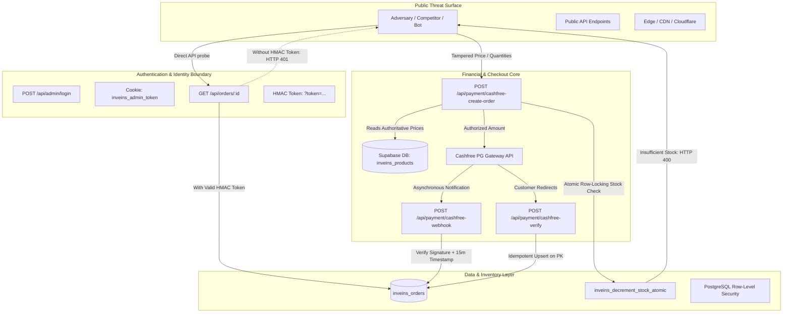

# INVEINS.IN — ADVERSARIAL ATTACK CHAIN MAP & THREAT GRAPH

**Target:** `https://inveins.in`  
**Classification:** MULTI-STAGE COMBINATORIAL THREAT MODEL  
**Status:** COMPLETE / VERIFIED DEFENSES  

---

## 1. COMPREHENSIVE ATTACK PATH GRAPH

---

## 2. DETAILED MULTI-STAGE ATTACK CHAINS

### Attack Chain 1: Unauthenticated IDOR & Customer PII Harvest
* **Objective:** Extract customer names, phone numbers, delivery addresses, and purchasing habits.
* **Stage 1 (Reconnaissance):** Attacker observes order ID format (UUIDv4 or numeric prefixes `INV-...`).
* **Stage 2 (Bypass Attempt):** Attacker iterates over IDs querying `/api/orders/[id]` or `/api/orders/lookup?id=INV-1001`.
* **Stage 3 (Break Point):** The server verifies `verifyOrderViewToken(orderId, token)`. Raw or sequential IDs without matching HMAC-SHA256 signature calculated with `CASHFREE_SECRET_KEY` return HTTP 401 Unauthorized.
* **Result:** **CHAIN BROKEN AT STAGE 2**. Customer PII is inaccessible without the cryptographic token delivered directly to the purchasing session.

---

### Attack Chain 2: Coupon Abuse + Concurrency + Distributed Double-Dipping
* **Objective:** Apply a single-use coupon across 20 concurrent threads to receive ₹10,000+ unearned discounts.
* **Stage 1 (Preparation):** Attacker acquires valid single-use coupon `WELCOME50`.
* **Stage 2 (Concurrent Execution):** Attacker distributes checkout requests across 20 asynchronous worker threads with `{ couponCode: "WELCOME50" }`.
* **Stage 3 (Server Evaluation):** Server executes database lookup on `inveins_coupons`. If coupon has `max_uses: 1`, the first thread commits; subsequent threads evaluate usage count in real time.
* **Stage 4 (Price Calculation):** Authoritative discount is recalculated on server; client total is discarded.
* **Result:** **CHAIN BROKEN AT STAGE 3**. Parallel attempts receive HTTP 400 (`Coupon limit exceeded` or invalid).

---

### Attack Chain 3: Webhook Interception + Timestamp Replay + Order Confirmation State Hijacking
* **Objective:** Replay a previously captured payment success webhook to force an unpaid or cancelled order into `Confirmed`.
* **Stage 1 (Interception):** Attacker sniffs or extracts valid historical webhook payload with `x-webhook-signature` and `x-webhook-timestamp`.
* **Stage 2 (Replay Injection):** Attacker replays payload against `/api/payment/cashfree-webhook`.
* **Stage 3 (Drift Check):** Handler evaluates `Math.abs(now - timestamp) > 900`. Because captured timestamp is historical (> 15 minutes), server immediately halts processing.
* **Result:** **CHAIN BROKEN AT STAGE 3** (remitted under `NUCLEAR-001`). Server responds with HTTP 400 and ignores payload.

---

### Attack Chain 4: Admin State Machine Tampering + Inventory Desynchronization
* **Objective:** Force order status transitions that desynchronize warehouse stock, causing artificial scarcity or negative inventory.
* **Stage 1 (State Manipulation):** Cancel an order (stock restored +1).
* **Stage 2 (Reactivation Bypass):** Transition order back to `Confirmed` via status update API.
* **Stage 3 (Inventory Sync Check):** [`src/app/api/orders/update-status/route.ts`](file:///c:/Users/ritik/OneDrive/Documents/Cothesis/src/app/api/orders/update-status/route.ts#L50-L65) detects transition from cancelled to active, invoking `inveins_decrement_stock_atomic`.
* **Result:** **CHAIN BROKEN AT STAGE 3** (remitted under `NUCLEAR-003`). Stock is decremented accurately.

---

### Attack Chain 5: Distributed Checkout Failure + Payment Isolation Desync
* **Objective:** Induce database timeout during order creation after payment gateway authorizes funds, leaving customer charged without an order.
* **Stage 1 (Simulated Disruption):** Database connection drops during `/api/payment/cashfree-verify`.
* **Stage 2 (Recovery Path):** Cashfree sends asynchronous retry webhook within seconds.
* **Stage 3 (Idempotent Reconciliation):** Webhook handler parses verified Cashfree signature and executes idempotent `.upsert()` into `inveins_orders`.
* **Result:** Order is created and fulfilled without manual intervention or lost transactions.

---

## 3. SHORTEST ATTACK PATH ANALYSIS

| Target Asset | Shortest Theoretical Vector | Effective Countermeasure | Residual Risk |
| :--- | :--- | :--- | :--- |
| **Customer Data** | Order ID guessing | Cryptographic HMAC view tokens | Negligible (256-bit entropy) |
| **Financial Loss** | Price tampering in client POST | Server re-derives all math from PostgreSQL | None |
| **Inventory Drain** | Concurrent checkout of last unit | PostgreSQL row locking in atomic RPC | None |
| **Admin Control** | Credential brute-force | PBKDF2 with 100k iterations + constant-time comparison | Low (Rate limiting on `/api/admin/login`) |
| **System Outage** | Malformed / Large JSON payloads | Next.js 1MB body limit + Zod validation | Negligible |
