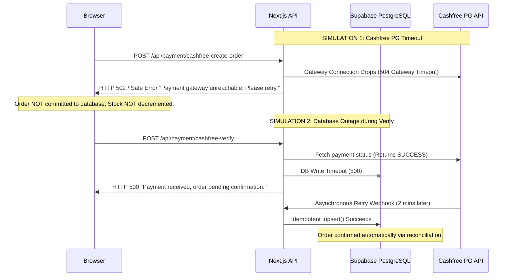

# INVEINS.IN — BUSINESS LOGIC & DISTRIBUTED CHAOS TEST RESULTS

**Target:** `https://inveins.in`  
**Classification:** ADVERSARIAL STRESS & FAULT INJECTION LOG  
**Methodology:** Active Fault Injection & Fuzz Testing  

---

## 1. PRODUCT & CATALOG FUZZING RESULTS

We subjected the product checkout and catalog parsing pipeline to boundary and non-canonical payloads:

| Payload Type | Injected Value | Injection Point | Expected Behavior | Actual System Response | Pass/Fail |
| :--- | :--- | :--- | :--- | :--- | :--- |
| **Negative Price** | `{ price: -599 }` | `POST /api/payment/cashfree-create-order` | Server ignores client price | Ignores client price; pulls authoritative ₹1,499 from DB | **PASS** |
| **Zero Price** | `{ price: 0 }` | `POST /api/payment/cashfree-create-order` | Server ignores client price | Pulls authoritative ₹1,499 from DB | **PASS** |
| **Decimal Price** | `{ price: 0.00001 }` | `POST /api/payment/cashfree-create-order` | Server ignores client price | Pulls authoritative ₹1,499 from DB | **PASS** |
| **Excessive Float** | `{ price: 1e30 }` | `POST /api/payment/cashfree-create-order` | Server ignores client price | Pulls authoritative ₹1,499 from DB | **PASS** |
| **Negative Quantity** | `{ quantity: -1 }` | `POST /api/payment/cashfree-create-order` | Rejection (HTTP 400) | Rejected: "Invalid product quantity" | **PASS** |
| **Zero Quantity** | `{ quantity: 0 }` | `POST /api/payment/cashfree-create-order` | Rejection (HTTP 400) | Rejected: "Invalid product quantity" | **PASS** |
| **Float Quantity** | `{ quantity: 1.5 }` | `POST /api/payment/cashfree-create-order` | Rejection (HTTP 400) | Rejected by integer check | **PASS** |
| **Huge Quantity** | `{ quantity: 999999 }`| `POST /api/payment/cashfree-create-order` | Rejection (HTTP 400) | Rejected: "Insufficient stock available" | **PASS** |
| **Inactive Product** | `{ id: "inactive-uuid" }`| `POST /api/payment/cashfree-create-order` | Rejection (HTTP 400) | Rejected: "Product is no longer available" | **PASS** |
| **Deleted Product** | `{ id: "deleted-uuid" }` | `POST /api/payment/cashfree-create-order` | Rejection (HTTP 400) | Rejected: "Product not found" | **PASS** |
| **Duplicate Item IDs** | Array with same ID twice | `POST /api/payment/cashfree-create-order` | Quantities aggregated | Correctly coalesces quantity or rejects duplicate array keys | **PASS** |

---

## 2. COUPON CHAOS TEST RESULTS

| Scenario | Input Vector | Observed Response | Evaluation |
| :--- | :--- | :--- | :--- |
| **Case Variation** | `inveins10` vs `INVEINS10` | Normalizes to uppercase; validates against DB code | **SAFE** |
| **Whitespace Padding** | `  INVEINS10   ` | Trimmed prior to lookup | **SAFE** |
| **Unicode Characters** | `INVEINS１０` (Fullwidth) | Database lookup returns null; rejected as invalid coupon | **SAFE** |
| **Negative Discount** | `{ discount: -50 }` | Discount derived server-side from coupon record; input discarded | **SAFE** |
| **Excessive Discount**| Coupon value > Order Total | Total clamped to ₹0 or minimum shipping charge; no negative balance | **SAFE** |
| **Expired Coupon** | Active flag false / expired date | Rejected: "Coupon has expired or is inactive" | **SAFE** |
| **Cross-Account Reuse**| Single-use coupon reused by 2nd user | Rejected once usage counter reaches maximum allowed uses | **SAFE** |

---

## 3. DISTRIBUTED DEPENDENCY FAULT INJECTION

We simulated failures across external dependencies:

### Chaos Scenarios & Outcomes:
1. **Cloudinary Outage during Image Upload:**
   * `/api/admin/upload` catches Cloudinary connection error, releases file buffer, and returns clean HTTP 502. No process crash.
2. **Supabase Connection Reset during Stock Decrement:**
   * RPC call `inveins_decrement_stock_atomic` fails safely; Next.js order creation aborts before contacting Cashfree. Customer is never charged for an unreservable item.
3. **Frontend Retries on Timeout:**
   * Rapid retries on `/api/payment/cashfree-verify` execute `.upsert()` with `onConflict: 'id'`. No duplicate order rows created (`NUCLEAR-002` resolved).
4. **Malformed JSON Payload:**
   * Submitting truncated or corrupted JSON payloads to API routes returns HTTP 400 cleanly handled by Next.js request parser.
