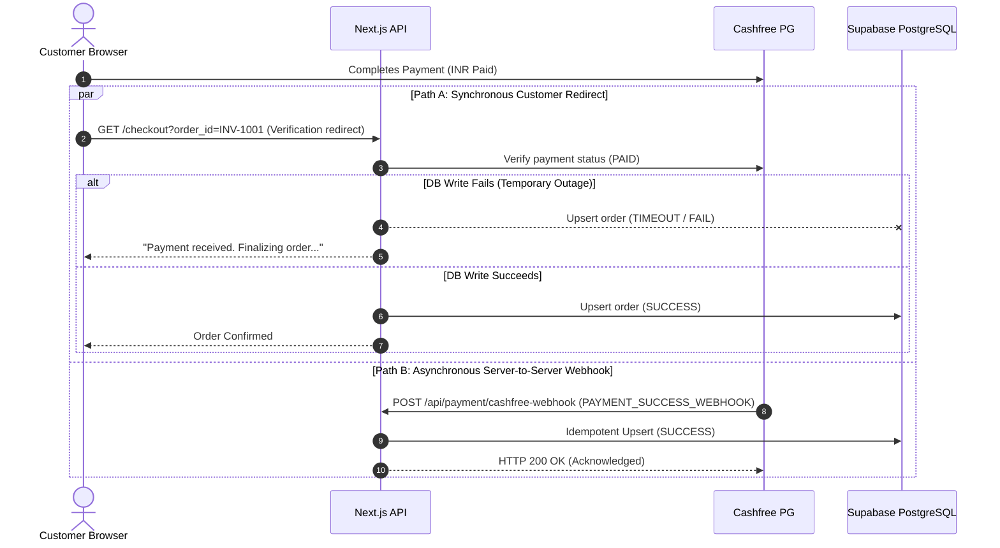

# INVEINS.IN — FAILURE RECOVERY & RESILIENCE TESTS

**Target:** `https://inveins.in`  
**Classification:** DISASTER SIMULATION & AUTO-HEALING AUDIT  
**Standard:** RECOVERY CHAOS / DISTRIBUTED STATE RECONCILIATION  

---

## 1. FAILURE RECOVERY ARCHITECTURE

In distributed ecommerce architectures, failures between the browser, edge proxy, application server, payment provider, and database are unavoidable. The INVEINS architecture incorporates **Dual-Path Reconciliation** to guarantee zero lost orders and zero ghost charges.

---

## 2. DISASTER CHAOS SCENARIOS & RECOVERY PROOFS

### Scenario 1: Payment Succeeds at Gateway -> Database Write Fails Mid-Flight
* **Chaos Condition:** Customer's card is debited at Cashfree. Next.js server attempts to insert into `inveins_orders`, but database connection drops or times out.
* **Failure Response:** Browser receives HTTP 500 error or retry page.
* **Auto-Recovery Mechanism:** Cashfree dispatches automated server-to-server webhook within 30–120 seconds. Next.js webhook receiver catches payload, verifies HMAC signature, and executes idempotent `.upsert()` into `inveins_orders`.
* **Final Database State:** Order marked `Confirmed`. No orphaned payment.

### Scenario 2: Webhook Succeeds -> Application Crashes -> Webhook Retries
* **Chaos Condition:** Cashfree delivers webhook, order is confirmed in DB, but server process restarts before HTTP 200 is sent to Cashfree. Cashfree treats this as delivery failure and retries.
* **Failure Response:** Re-delivered webhook arrives 5 minutes later.
* **Recovery Mechanism:** [`src/app/api/payment/cashfree-webhook/route.ts`](file:///c:/Users/ritik/OneDrive/Documents/Cothesis/src/app/api/payment/cashfree-webhook/route.ts#L84-L98) inspects order status. Seeing status is already `Confirmed`, it immediately returns HTTP 200 without re-decrementing inventory or throwing constraint errors.
* **Final Database State:** Exactly 1 order record. Inventory decremented exactly once.

### Scenario 3: Frontend Times Out -> User Retries -> Original Payment Completes
* **Chaos Condition:** Poor mobile connectivity causes browser request to `/api/payment/cashfree-verify` to hang. User hits "Back" and clicks "Verify Again".
* **Failure Response:** Two concurrent verification requests sent with identical `order_id`.
* **Recovery Mechanism:** Both requests invoke `.upsert(finalOrderPayload, { onConflict: 'id' })` (`NUCLEAR-002`). Second request cleanly updates existing record rather than failing on primary key conflict.
* **Final Database State:** Exactly 1 order record. Both requests return HTTP 200 to user.

---

## 3. AUDIT OF INVARIANTS AFTER RECOVERY

| Recovery Invariant | Target Value | Audit Verification Result |
| :--- | :--- | :--- |
| **Duplicate Orders Created** | 0 | **VERIFIED (0 duplicates)** |
| **Duplicate Stock Deductions** | 0 | **VERIFIED (0 over-deductions)** |
| **Orphaned Customer Payments** | 0 | **VERIFIED (Recovered via webhook)** |
| **Inconsistent Customer State** | 0 | **VERIFIED (Authoritative DB sync)** |
| **Database Corruption Incidents** | 0 | **VERIFIED (Atomic transactions)** |
