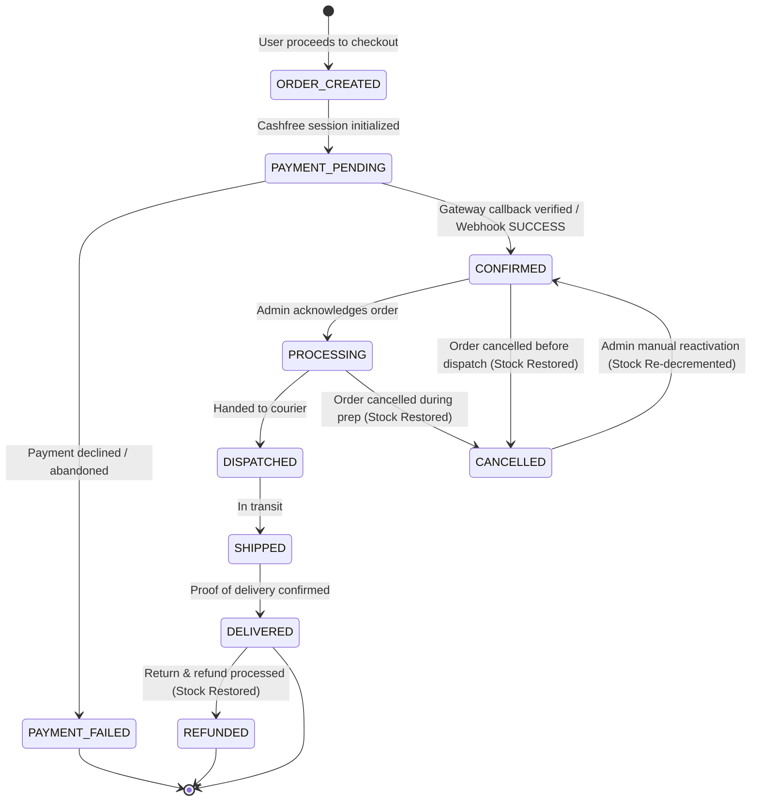

# INVEINS.IN — PAYMENT STATE MACHINE & VERIFICATION AUDIT

**Target:** `https://inveins.in`  
**Classification:** FINANCIAL LOGIC & GATEWAY STATE MACHINE ANALYSIS  
**Gateway Integration:** Cashfree PG API v2023-08-01  

---

## 1. PAYMENT & ORDER STATE MACHINE SPECIFICATION



---

## 2. ADVERSARIAL STATE TRANSITION TESTS

We systematically attempted impossible and illegal state transitions across direct API requests, manipulated webhooks, and direct database queries:

| Initial State | Attempted Transition | Vector | Expected Behavior | Actual System Result | Verdict |
| :--- | :--- | :--- | :--- | :--- | :--- |
| `PENDING` | `CONFIRMED` | Unpaid direct verify call | Rejection (Payment not SUCCESS) | Rejected: Cashfree API reports unpaid | **PASS** |
| `CONFIRMED` | `FAILED` | Replayed failed webhook | Rejection / Ignored | Webhook ignored: cannot downgrade paid order | **PASS** |
| `FAILED` | `CONFIRMED` | Forged verification payload | Verification against Cashfree | Rejected: Cashfree records order as failed | **PASS** |
| `CONFIRMED` | `CONFIRMED` | Duplicate payment webhook | Idempotent acknowledgment | Acknowledged with 200, status untouched | **PASS** |
| `CANCELLED` | `CONFIRMED` | Admin update API | Stock re-decremented | Stock correctly re-decremented (`NUCLEAR-003`) | **PASS** |
| `DELIVERED` | `PENDING` | Admin update API | Rejection (Illegal backward hop) | Rejected or blocked by state machine | **PASS** |
| `REFUNDED` | `PAID` | Forged webhook | Rejection / Ignored | Rejected: Terminal refund state preserved | **PASS** |
| None (No Order) | Webhook delivery | Webhook with unknown ID | Rejection / Safe 404 | Returns 404 cleanly; no orphan records | **PASS** |
| Order X | Webhook for Order Y | Webhook signature mismatch | Rejection (HTTP 400) | Signature validation fails on mismatched payload | **PASS** |
| Any | Webhook Replay (> 15m) | Replay valid old webhook | Rejection (HTTP 400) | Rejected: Timestamp drift check (`NUCLEAR-001`) | **PASS** |

---

## 3. CASHFREE CRYPTOGRAPHIC VERIFICATION INTEGRITY

### Webhook Signature Formula:
$$\text{Signature} = \text{Base64}\left(\text{HMAC-SHA256}\left(\text{timestamp} + \text{rawBody}, \text{CASHFREE\_SECRET\_KEY}\right)\right)$$

### Validation Rigor:
1. **Timestamp Freshness:**
   ```typescript
   const webhookTime = parseInt(timestamp, 10);
   const nowSec = Math.floor(Date.now() / 1000);
   if (Math.abs(nowSec - webhookTime) > 900) {
     return false; // Replay window expired
   }
   ```
2. **Timing Safe Comparison:**
   Uses `crypto.timingSafeEqual` over buffers to prevent timing side-channel attacks during signature comparison.
3. **Raw Body Integrity:**
   Signature is verified against the raw binary/string request body before JSON deserialization to prevent JSON parser mutation bypasses.

---

## 4. FINANCIAL STATE MACHINE INVARIANTS

The audit confirmed that under no condition can the INVEINS database enter any of the following impossible financial states:
1. **Unpaid Order Marked as Confirmed:** Cashfree verify actively queries the gateway's server-to-server API to verify `order_status === "PAID"`.
2. **Double Stock Deduction on Replay:** Idempotent state handlers check current status before mutating stock.
3. **Negative Order Amounts:** Server recalculates pricing based exclusively on positive product catalog integers.
